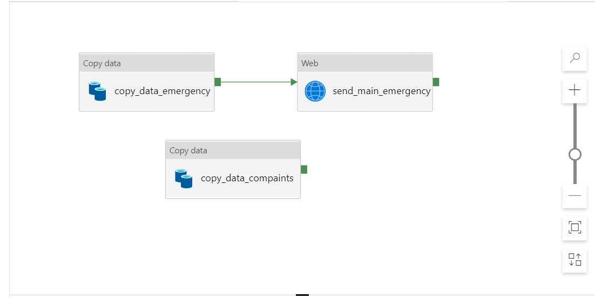
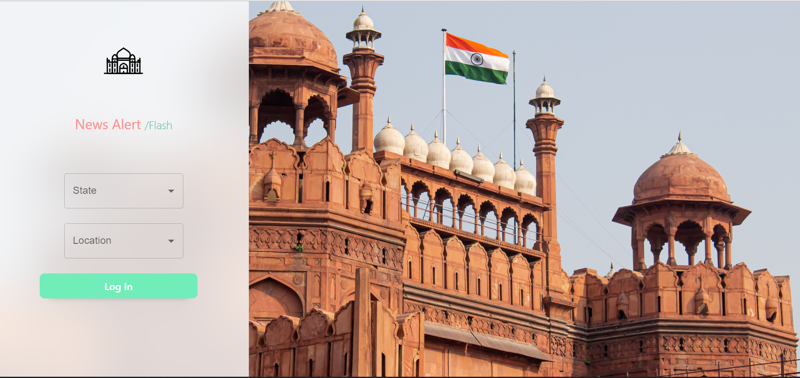
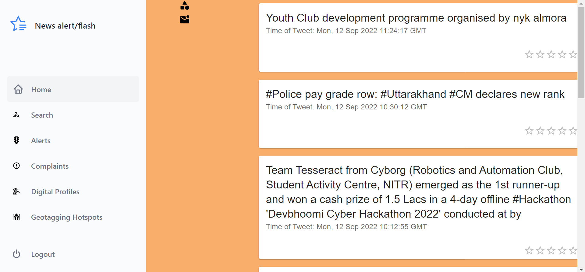
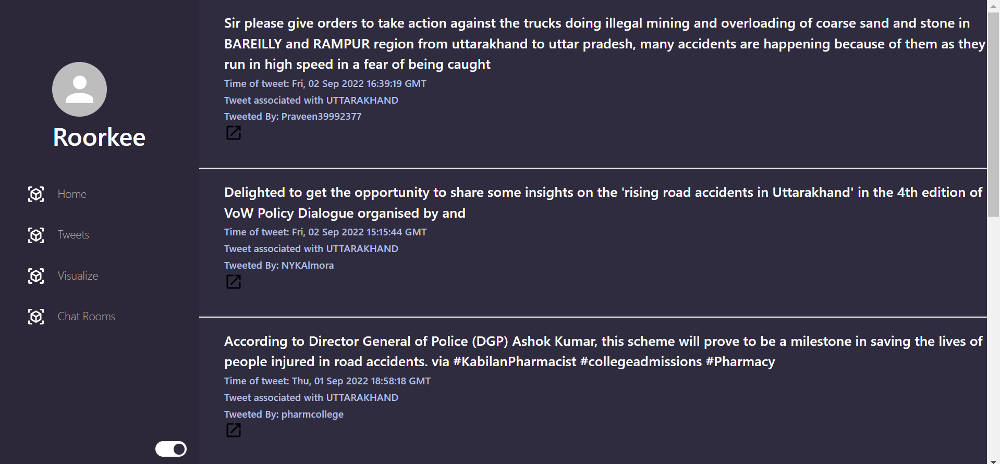
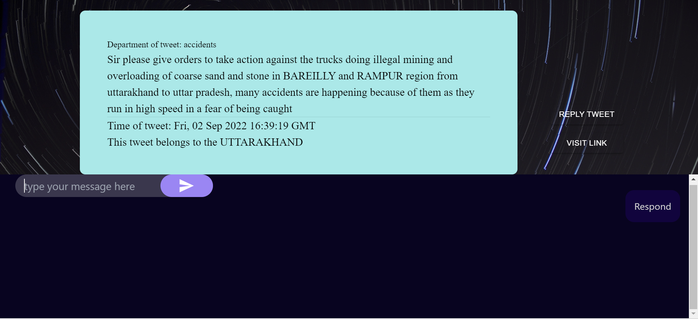
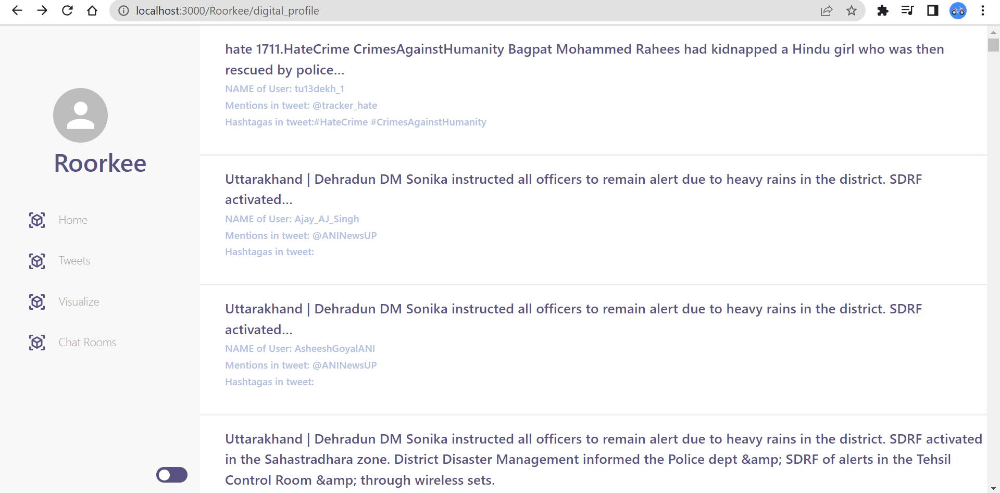
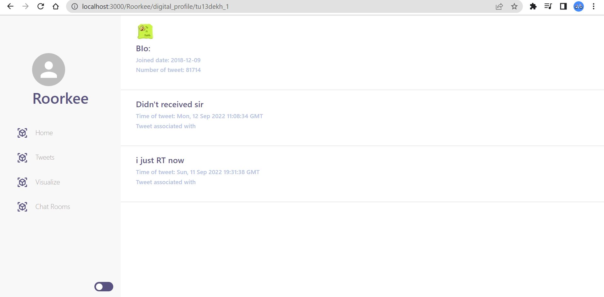

# Twitter Analysis and First Response Application

- The application is built for the police department to check for **incidents** from **Twitter**.
- This application provides **real-time Twitter analysis** about incidents in a state and send email to the respective police department.
- **Analysis** of tweets to find if it is related to a complaint or police incident
- Collect information about a **suspect** from twitter and get the timeline of a tweet posted by the suspect
- Provide **priority** to tweets and respond to tweets directly from the application.
- Displays the tweets **tagged** or mentioned to the respective state's police department.
- In-built **chat feature** which can be used to chat between users.
- A **login** system based on the state and city in India(a representation of important police stations in a city).
- Get the **complaints** made on Twitter to different departments of police
- Populating Twitter data automatically using **azure functions** and time-based triggers.
- Tagging of geo hotspots of crime using Twitter data(in development).

# Tech Stack

- React with Next JS(Frontend)
- Backend: Node JS (API endpoints and API routes in next js) -> Primarily used for MongoDB and posting of tweets
- Twitter tweet extracter: Python Flask API => Hosted in Azure Web app --> Extract tweets based on paramters
- Backend(Tweet analyser): Python Flask API => Hosted in Azure web app --> Analysis

> Note: The tweet analyzer link, tweet extractor link, MongoDB link, and database name must be provided in the `.env.local` file

# Local Development

- Clone the repository

```bash==
git clone "https://github.com/harisankar01/Twitter-Analysis-and-First-Response-Appliaction.git"
```

- Move into the cloned folder

```bash==
cd Twitter-Analysis-and-First-Response-Application
```

- Install all the packages

```bash==
npm install
```

# Links

- Create and add the following links in the `.env.local` file
  - Link to the Twitter extractor backend API(either deployed or running locally) -> [twitter-extractor-backend](https://github.com/harisankar01/twitter-extractor-backend)
  - Link to the Twitter analyser backend API(either deployed or running locally) -> [Twitter-analyser-backend](https://github.com/harisankar01/Twitter-analyser-backend.git)
  - MongoDB cluster running locally or remotely. A simple option will be to use the [MongoDB-Atlas](https://www.mongodb.com/atlas/database)

> Note: Visit the repos mentioned above separately to know how to deploy the backend or develop it.

You can refer to the `sample.env` file for the structure to be used in `.env.local`.

To run the server, use the following command,

```
npm run dev
```

# Images

The images have been uploaded to **Cloudinary** and the link to those uploaded images is present in the MongoDB database.

# Azure Development

Azure functions have been used for the following functions,

- Populate the MongoDB database with new data extracted by the Twitter extractor API
- Populate the database with processed data
- Send an email to the user about the incidents
  A time-based trigger is used to populate the databases.

Please check the image for the structure of the pipeline,


The websites are deployed with **azure web app** directly from visual studio using the Azure Cloud extension of visual studio.

The configuration of the database used is: **Cosmos DB with MongoDB API** and is present in the azure cloud Mumbai region.

# ScreenShots

### The user can log in by selecting the state and the city in India.



### The home page loads the tweets that were tagged or mentioned to the police of that city.



### The complaints page shows the complaints given to the people of the state



### The Chat is featured as a chat room for each tweet



### The timeline of tweets posted by suspected people can be viewed in the digital profile section



### When a tweet in the timeline module is clicked, it will lead to the page featuring the basic details of the suspect



### Addition Remarks

Please feel free to ask anything about the project.
